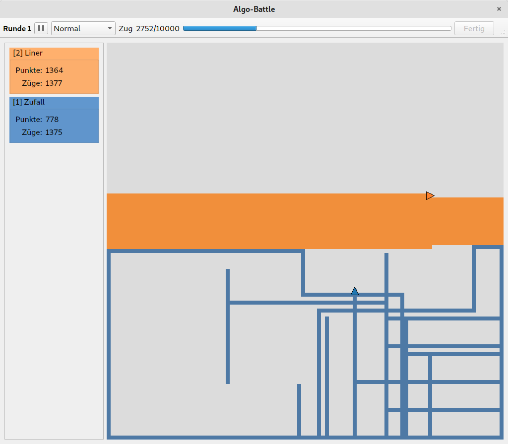

# Algo Battle




## Installation

Basiert auf Python3, idealerweise in einer virtuellen Umgebung installieren:

```bash
python3 -m venv venv
. venv/bin/activate
pip3 install algo-battle
```

## Starten

```bash
python3 -m algo_battle GUI
```

## Anleitung

Eine ausführliche Anleitung zur Verwendung ist unter [anleitung](anleitung/) zu finden. 
