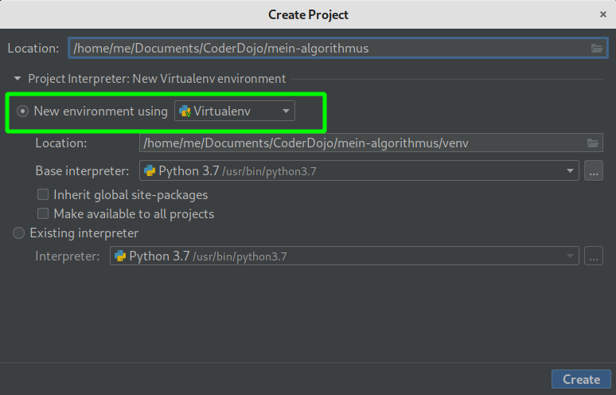
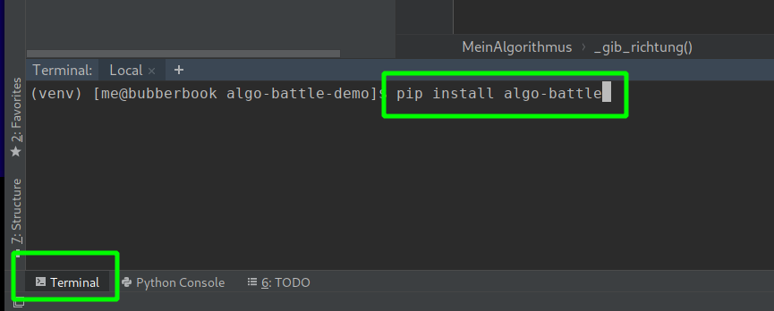
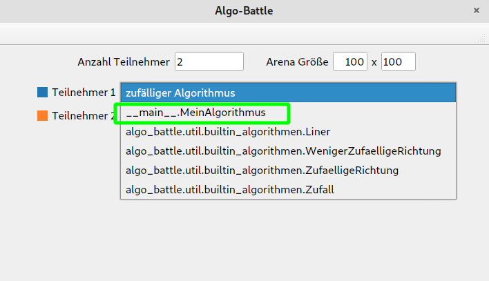
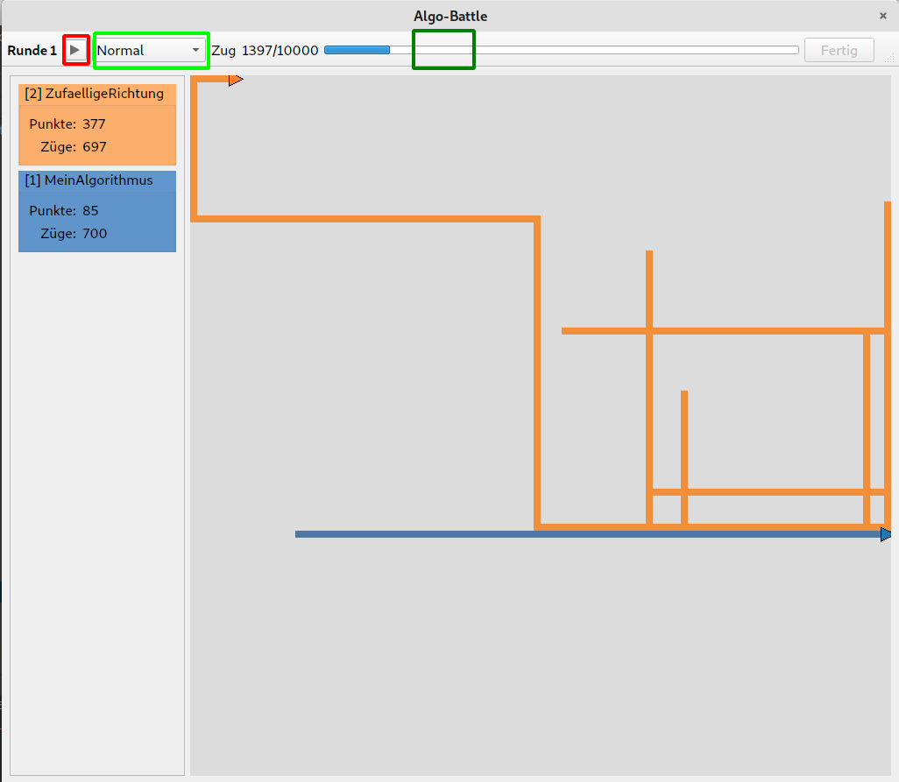

# Algo-Battle

## Installation

Erstelle ein neues leeres Projekt in Pycharm am Besten in einem _"Virtualenv environment"_ (dies ist die Standardeinstellung). 
 


Installiere das Algo-Battle über `pip` indem du im Terminal (klicke auf Terminal unten in der Leiste bei Pycharm) folgenden Befehl eintippst:

```bash
pip install algo-battle
```



Dies installiert `algo-battle` und alle dafür benötigten Module. Die Installation kann eine Weile dauern!

## Die Idee

Auf einem Spielfeld, dass aus einzelnen Feldern aufgebaut treten 2 oder mehr Alorithmen gegeneinander an.
Die Aufgabe jedes Algorithmus ist möglichst viele Felder des Spielfeldes in dessen Farbe zu markieren.
Für jedes markierte Feld bekommt der Algorithmus einen Punkt. Felder die von einem Algorithmus markiert wurden
können nicht mehr von andereren Algorithmen betreten und somit auch nicht "übermalt" werden.


## Erste Schritte

Alles was du tun musst, ist eine Unterklasse von Algorithmus erstellen und darin die Methode `_gib_richtung()` zu implementieren, 
die die Bewegung deines Alorithmuses auf dem Spielfeld steuert. Am Einfachsten verwendest du folgenden Code als Basis
für deinen Algorithmus.


Erstelle eine neue Python-Datei und füge folgenden Code ein:

```python
from algo_battle.domain.algorithmus import Algorithmus
from algo_battle.domain import FeldZustand, Richtung


class MeinAlgorithmus(Algorithmus):

    def __init__(self):
        super().__init__()

    def _gib_richtung(self, letzter_zustand: FeldZustand, zug_nummer: int, aktuelle_punkte: int) -> Richtung:
        # Dieser (sehr dumme) Algorithmus fährt immer nur nach rechts :)
        # Hier sollte dein Algorithmus stehen!
        # WICHTIG: Diese Funktion muss eine Richtung, zurückgeben, z.b Richtung.Unten

        return Richtung.Rechts


if __name__ == "__main__":
    from algo_battle.app.pyside2_gui import start_gui

    start_gui([__name__])


```

Wirklich wichtig ist hierbei nur der Code innerhalb der Methode `_gib_richtung()`.
Dieser Algorithmus tut nichts sonderlich schlaues, er fährt einfach immer nur nach rechts,
und bleibt am rechten Rand kleben...

Starte das Programm indem du das Skript ausführst (Rechtsklick in die Datei und `Run 'Name der Datei'` auswählen).
Du solltest von folgendem Fenster begrüßt werden.



In der Übersicht kannst du die Algorithmen auswählen, die gegeneinander antreten sollen.
Es gibt eine Reihe mitgelieferter Algorithmen, deiner sollte in der List ganz oben stehen.




Wenn du den Wettkampf startest siehst du wie die beiden Algorithmen Felder für sich markieren. Du kannst den Wettkampf pausieren, die Abspielgeschwindigkeit ändern
UND jeder Zeit über Klick auf den Fortschrittsbalken vor- bzw. zurück springen. Auch nachdem der Wettkampf vorüber ist! 


## Einen eigenen Algorithmus programmieren

Um einen neuen Algorithmus zu entwickeln solltest du dir zuerst eine Strategie überlegen, wie du möglichst
viele Felder für dich markieren kannst. Um deine Strategie zu implementieren findest du hier die dir zur Verfügung stehenden Befehle
und ein paar Beispiel-Algorithmen.

Für jeden Algorithmus wird die `_gib_richtung()` Methode periodisch aufgerufen, diese muss eine der vier möglichen Richtungen
zurück geben. Daraufhin wird versucht den Algorithmus in diese Richtung zu bewegen. Ist eine Bewegung in diese Richtung möglich
wird die Bewegung durchgeführt und ggf. ein neu besuchtes Feld markiert. Ist eine Bewegung in die gewünschte Richtung
nicht möglich wird keine Bewegung ausgeführt. Das Ergebnis der letzten gewünschten Bewegung wird bei jedem Aufruf von `_gib_richtung()` als
erstes Argument mit übergeben. 

### Wichtige Befehle

Hier findet ihr eine kurze Übersicht wichtiger Befehle und Variablen, die euch helfen können.


#### Die Methode `_gib_richtung`

```python

def _gib_richtung(self, letzter_zustand: FeldZustand, zug_nummer: int, aktuelle_punkte: int) -> Richtung:

    # gehe bei jedem Zug in eine zufällige Richtung    
    return Richtung.zufall()
```

Der Methode `_gib_richtung` werden 3 Argumente übergeben:
 
 
1. Das erste und wichtigste Argument gibt Aufschluss darüber, wie der Zustand des Feldes ist, auf das der Algorithmus in der letzten Runde gezogen ist.

   - **Wichtig:** war das gewünschte Feld ein Rand-Feld oder bereits von einem Gegenspieler belegt, so war der Zug nicht möglich und 
   die Begung wurde nicht ausgeführt! War das Feld bereits von deinem Algorithmus zuvor besucht worden, so ist der Zug möglich aber du gewinnst kein neues Feld dazu
   
   - Mögliche Werte sind: `FeldZustand.Frei`, `FeldZustand.Besucht`, `FeldZustand.Wand`, `FeldZustand.Belegt`

   - Zur Bequemlichkeit gibt es die Eigenschaften `letzter_zustand.ist_blockiert` (Wand oder Belegt) und `letzter_zustand.ist_betretbar` (Frei oder Besucht) für FeldZustände, 
   die angeben, ob der letzte Zug möglich war oder nicht.
   
2. Der zweite Wert gibt die aktuelle Zugnummer an

3. Der dritte Werte gibt Auskunft über deine aktuell erzielte Punktzahl (die Anzahl von dir markierter Felder)


Als Rückgabewert muss eine `Richtung` zurückgegeben werden  


#### Richtungen

1. Es gibt vier mögliche Richtungen: `Richtung.Oben`, `Richtung.Rechts`, `Richtung.Unten` und `Richtung.Links`.

2. Diese Richtungen haben folgende Eigenschaften:

    1. `ist_horizontal` -> gibt an ob Richtung horizontal (links oder rechts ist)

    2. `ist_vertikal` -> gibt an ob Richtung vertikal (oben oder unten ist)
    
    3. `gegenteil` -> gibt die gegenteilige Richung zurück
    
   Bsp: `Richtung.Oben.gegenteil == Richtung.Unten`
   
3. Folgende Methoden stehen zur Verfügung:
    
    1. `drehe_nach_rechts()` dreht die nach rechts, also von `Richtung.Oben` zu `Richtung.Rechts`
    
    2. `drehe_nach_links()` dreht die nach links, also von `Richtung.Rechts` zu `Richtung.Oben`
    
    3. `zufall() gibt eine zufällige Richtung aus. Optional kann auch eine oder mehrere verbotene Richtungen angegeben werden:
    `zufall(ausser=Richtung.Oben)`
    
   Bsp: `Richtung.Oben.drehe_nach_rechts() == Richtung.Rechts`
    

#### Die Klasse `Algorithmus`

1. Die Methode `self.abstand(richtung)` gibt den aktuellen Abstand zum Rand in die angegebene Richtung.
   Bsp: `self.abstand(Richtung.Rechts)` gibt den Abstand zum rechten Rand aus
   
2. Die Eigenschaft `self.richtung` gibt Auskuft über die aktuelle Richtung. Mit dem Aufruf von `_gib_richtung()` wird die
   Richtung intern für deinen Algorithmus auf den angegebenen Rückgabewert gesetzt. Du musst die Richtung also nicht selbst setzen.


#### Beispiel 1: Zufällige Bewegung 

Eine einfache Möglichkeit ist es den Algorithmus in jedem Zug in eine zufällige Richtung zu schicken:

```python
class Zufall(Algorithmus):

    def __init__(self):
        super().__init__()

    def _gib_richtung(self, letzter_zustand: FeldZustand, zug_nummer: int, aktuelle_punkte: int) -> Richtung:

        # gehe bei jedem Zug in eine zufällige Richtung
        return Richtung.zufall()
```

Dies ist nicht die beste Wahl, da ein guter Algorithmus möglichst viele neue Felder für sich beanspruchen soll, 
aber der Zufallsalgorithmus oftmals auf das gleiche Feld fährt.


Eine mögliche Optimierung ist es deshalb es zu verbieten in die genau gegenteilige Richtung zu fahren. 
D.h. wurde der Algorithmus gerade nach links bewegt, darf er sich im nächsten Zug **nicht** nach rechts bewegen,
da er ja von diesem Feld kam! Aus diesem Grund kann man der Methode `Richtung.zufall(ausser=[self.richtung.gegenteil])` eine
Liste von verbotenen Richtungen mitübergeben:

```python
def _gib_richtung(self, letzter_zustand: FeldZustand, zug_nummer: int, aktuelle_punkte: int) -> Richtung:
    # gehe bei jedem Zug in eine zufällige Richtung
    return Richtung.zufall(ausser=[self.richtung.gegenteil])
```

#### Beispiel 2: Bewegung in eine zufällige Richtung

Anstatt bei jedem Zug in eine neue Richtung zu fahren, ist es auch denkbar für eine bestimmte Anzahl an Zügen in die gleiche zufällige Richtung zu fahren.
Der Code dafür könnte dann so aussehen:

```python
class ZufaelligeRichtung(Algorithmus):

    def __init__(self):
        super().__init__()

        # der Wert wird beim ersten Durchlauf bestimmt
        self._schritte_in_gleiche_richtung = 0

    def _gib_richtung(self, letzter_zustand: FeldZustand, zug_nummer: int, aktuelle_punkte: int) -> Richtung:

        # laufe Anzahl Schritte in die gleiche Richtung ODER ändere frühzeitig die Richtung falls das Feld blockiert ist
        if self._schritte_in_gleiche_richtung <= 0 or letzter_zustand.ist_blockiert:

            # zufällige Anzahl an Schritten wählen, die der Algorithmus in eine Richtung läuft
            self._schritte_in_gleiche_richtung = random.randint(5, 50)

            # eine neue zufällige Richtung auswählen, die NICHT die aktuelle Richtung ist!
            return Richtung.zufall(ausser=self.richtung)

        # einen Schritt in die aktuelle Richtung machen
        self._schritte_in_gleiche_richtung -= 1
        return self.richtung
```

#### Weitere Algorithmen

Du kannst dir auch gerne den Quellcode der mitgelieferten Algorithmen anschauen. Diese findest du [hier](../algo_battle/util/builtin_algorithmen.py).